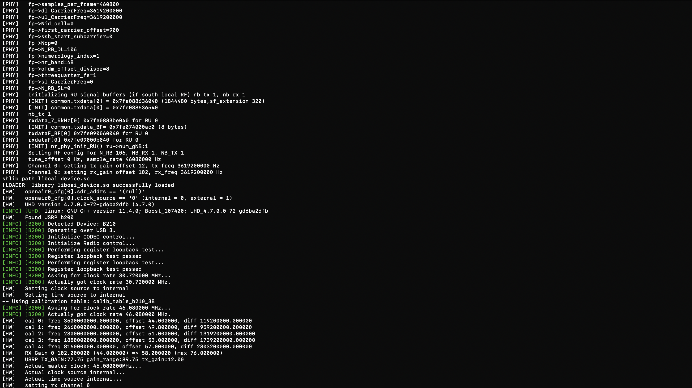
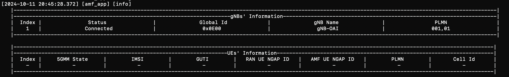

# OAI 5G CN + USRP B210 + COTS UE 

#### Requirements
    1. Ubuntu Server 22.04 # Intel CPU Preferred
    2. Docker
    3. USRP B200/B210
    4. 5G Supported Phone / Modem
    5. Programmable Sim Cards
    6. Sim Card Reader Writer

#### Docker Setup 
<a href="https://docs.docker.com/engine/install/ubuntu/">Install Docker</a> 
<a href="https://docs.docker.com/engine/install/linux-postinstall/">Docker Post Installation Steps on Linux</a>

#### Note: Make sure USRP B210 is connected to server using USB 3.0, USRP B210 doesnt work on USB 2.0
#### Check USRP Connection
    lsusb

#### Clone the Repository
    git clone https://github.com/venkatmanavarthi/5g_testbed_tutorial
    cd 5g_testbed_tutorial/cots_ue_5g

#### UHD
    sudo apt install -y autoconf automake build-essential ccache cmake cpufrequtils doxygen ethtool g++ git inetutils-tools libboost-all-dev libncurses5 libncurses5-dev libusb-1.0-0 libusb-1.0-0-dev libusb-dev python3-dev python3-mako python3-numpy python3-requests python3-scipy python3-setuptools python3-ruamel.yaml

    git clone https://github.com/EttusResearch/uhd.git ~/uhd
    cd ~/uhd
    git checkout v4.6.0.0
    cd host
    mkdir build
    cd build
    cmake ../
    make -j $(nproc)
    make test # This step is optional
    sudo make install
    sudo ldconfig
    sudo uhd_images_downloader

#### Get openairinterface5g source code and Build gNB
    git clone https://gitlab.eurecom.fr/oai/openairinterface5g.git ~/openairinterface5g
    cd ~/openairinterface5g
    git checkout develop
    cd ~/openairinterface5g/cmake_targets
    ./build_oai -I
    # Build OAI gNB
    cd ~/openairinterface5g/cmake_targets
    ./build_oai -w USRP --ninja --gNB -C

#### Programming the Sim Card
    git clone https://gitea.osmocom.org/sim-card/pysim.git
    # Installing dependencies
    sudo apt-get install --no-install-recommends \
	pcscd libpcsclite-dev \
	python3 \
	python3-setuptools \
	python3-pycryptodome \
	python3-pyscard \
	python3-pip
    pip3 install --user -r requirements.txt

    # Prorgamming the sim
    ./pySim-prog.py --pcsc-device=0 --type="sysmoISIM-SJA5" --name=OpenAirInterface --mcc=001 --mnc=01 --imsi=001010000000001 --opc=C42449363BBAD02B66D16BC975D77CC1 --ki=fec86ba6eb707ed08905757b1bb44b8f --iccid="iccid provided by sim card provider" --pin-adm="prodivded by sim card provider" --acc="privided by sim card provider"

#### Running the CN
    docker compose up -d
    docker ps -a

docker logs -f oai-amf

#### Running gNB
    cd ~/openairinterface5g/cmake_targets/ran_build/build
    sudo ./nr-softmodem -O ~/5g_testbed_tutorial/cots_ue_5g/gnbband78usrpb210.conf --sa -E --continuous-tx

docker logs -f oai-amf

#### Clean Up
    docker compose down
